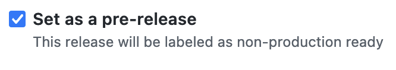

# Apps Rendering API Models

This project contains Thrift models and a way to publish them as Scala and TypeScript packages. MAPI uses the Scala package to send data to the Apps Rendering API, which uses the TypeScript package to deserialise the data. These two projects can be found here:

- MAPI (uses the Scala package): https://github.com/guardian/mobile-apps-api
- Apps-Rendering (uses the TypeScript package): https://github.com/guardian/dotcom-rendering/tree/main/apps-rendering

## How to release to NPM and Sonatype

This repository uses [`changesets`](https://github.com/changesets/changesets) to manage versions and releases.

To create a changeset, ensure you are using the correct Node (and associated npm) version defined in [`.nvmrc`](./.nvmrc) and project dependencies installed by running `npm install`. Then:

- Run `npx changeset`. Select the type of change and enter a description
- Commit and push the changeset file to your branch
- When your feature PR is merged to `main`, the [changesets action](.github/workflows/changesets.yaml) will open a PR against `main` with the details of all unreleased changes. This is a "Release PR"
- When ready to release, merge the Release PR

## How to release a Snapshot to NPM and Sonatype

- Push the branch with the changes you want to test to GitHub
- [**Click here**](https://github.com/guardian/apps-rendering-api-models/releases/new?prerelease=true) to create a **Prerelease** using GitHub Releases
    - Set the Target to your branch
    - You must also create a tag for the snapshot release. Use the following format: `v0.0.0-YYYY-MM-DD-SNAPSHOT`. For example, `v0.0.0-2022-10-20-SNAPSHOT`. It is important the tag **begins** with `v` and **ends** with `-SNAPSHOT`.
    - Make sure the "Set as pre-release" box is ticked:
    - 
    - To automatically release the snapshot to `npm` and `sonatype`, publish the prerelease
    - Snapshots are released to the `snapshot` tag on `npm`. You can install them with `npm install @guardian/apps-rendering-api-models@snapshot`

## How to run the tests

If you run `sbt test` it will fail, you can only run `sbt compile` to check that it's working correctly. This project doesn't have tests because it's used to auto-generate Scala and TypeScript packages from Thrift definitions, there's no Scala or TS source code.
